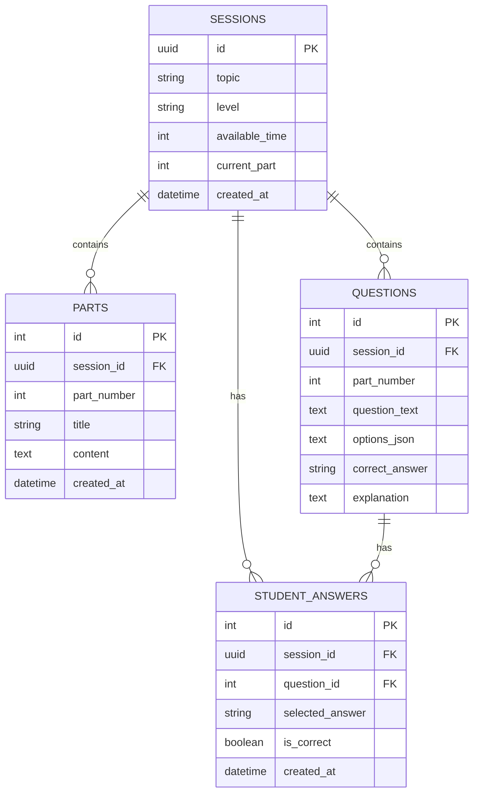

# Database Design

## Tables

### Sessions

Stores the main information about a student's learning session.

* `id`: Unique session identifier.
* `topic`: The learning topic selected by the student.
* `level`: The student's proficiency level.
* `available_time`: Total time available for the learning session, in hours.
* `current_part`: The current learning part in the session.
* `created_at`: Session creation timestamp.

### Parts

Stores the micro-learning lessons generated for a session.

* `id`: Unique part identifier.
* `session_id`: References the related session.
* `part_number`: The part number within the session.
* `title`: Title of the micro-lesson.
* `content`: Micro-lesson content.
* `created_at`: Part creation timestamp.

### Questions

Stores the questions generated for each learning part.

* `id`: Unique question identifier.
* `session_id`: References the related session.
* `part_number`: The learning part associated with the question.
* `question_text`: The question shown to the student.
* `options_json`: The available answer options stored as JSON.
* `correct_answer`: The correct answer used by the backend to evaluate the student's response.
* `explanation`: Explanation provided when the student's answer is incorrect.

### Student Answers

Stores the student's answers and learning interaction.

* `id`: Unique answer identifier.
* `session_id`: References the related session.
* `question_id`: References the answered question.
* `selected_answer`: The answer selected by the student.
* `is_correct`: Indicates whether the selected answer was correct.
* `created_at`: Answer submission timestamp.
