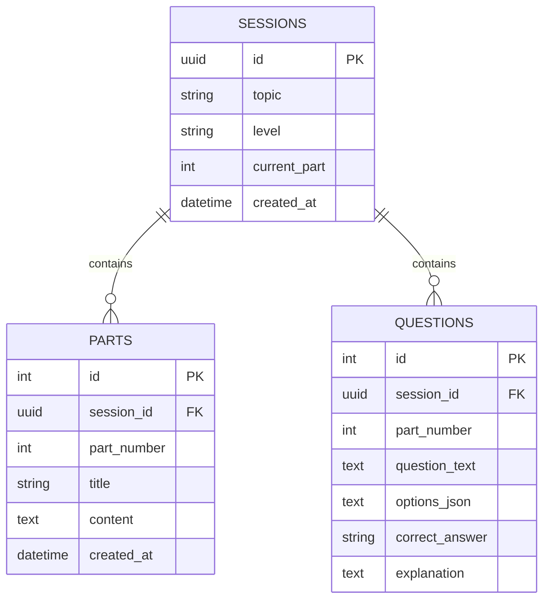

# Database design

```mermaid

erDiagram
    SESSIONS ||--o{ PARTS : "contains"
    SESSIONS ||--o{ QUESTIONS : "contains"

    SESSIONS {
        uuid id PK
        string topic
        string level
        int current_part
        datetime created_at
    }

    PARTS {
        int id PK
        uuid session_id FK
        int part_number
        string title
        text content
        datetime created_at
    }

    QUESTIONS {
        int id PK
        uuid session_id FK
        int part_number
        text question_text
        text options_json
        string correct_answer
        text explanation
    }
```
